# [Class project 2: User personas and information architecture]

### For this class project I have decided to create 3 user personas using ChatGPT for a interior design firm web application. Furthermore, I created the information arhitecture and sitemap of the app with the help of ChatGPT prompts.

## Personas

#### Generate Personas - ChatGPT prompt:

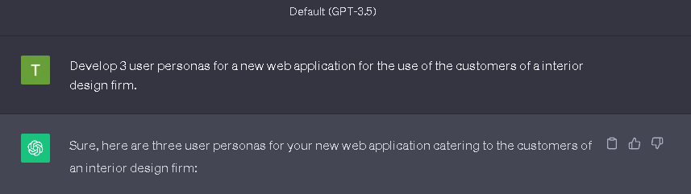

#### Persona 1: Alex

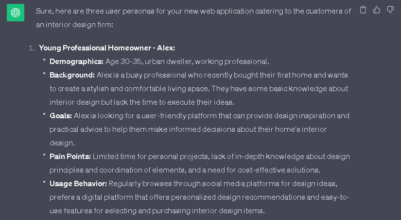

#### Generated bing image:

#### Persona 2: Sarah and John

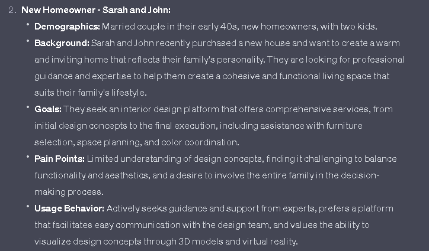

#### Generated bing image:

#### Persona 3: Mary and Rupert

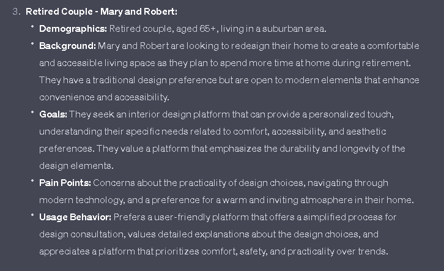

#### Generated bing image:

## Information arhitecture

#### Information arhitecture - ChatGPT prompt:

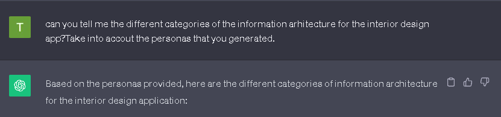

#### Response:

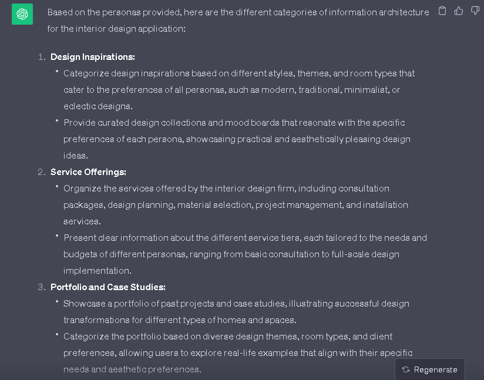
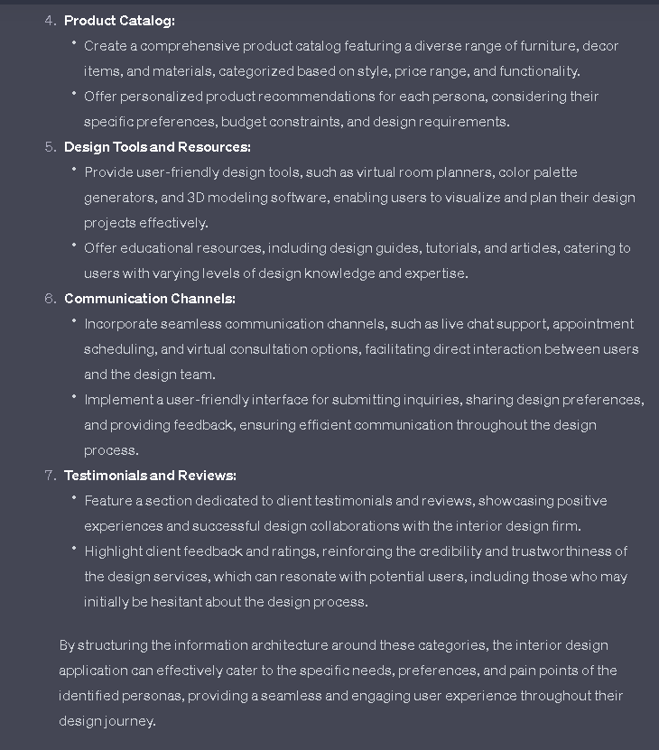

## Sitemap

#### Sitemap - ChatGPT prompt 1:

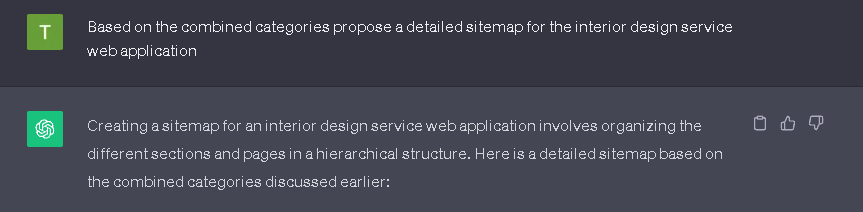

Response:
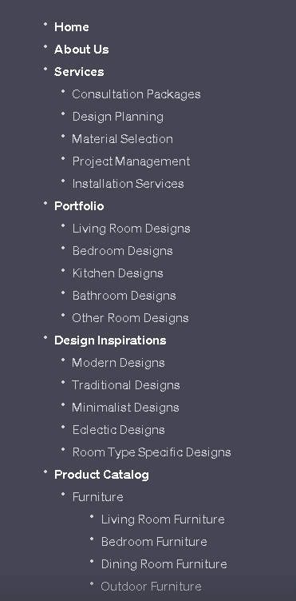
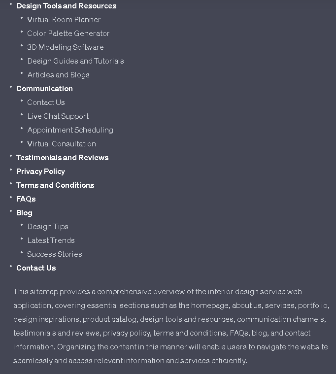

#### Sitemap - ChatGPT prompt 2:

Response:

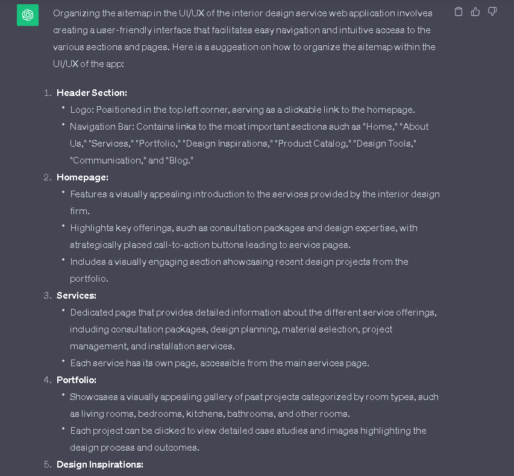
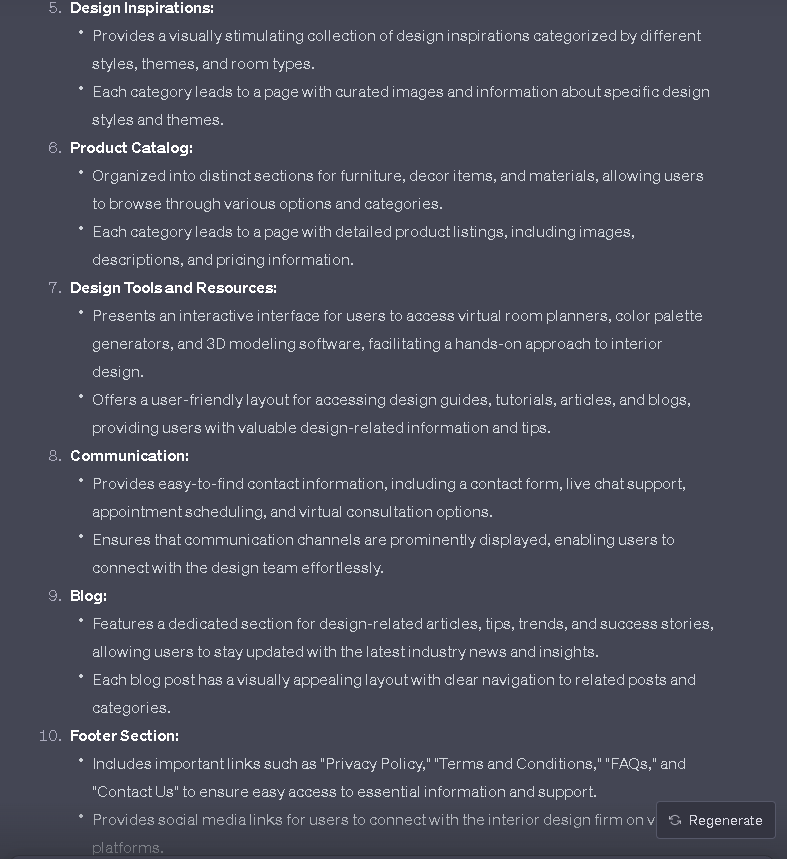

#### Sitemap - Excalidraw

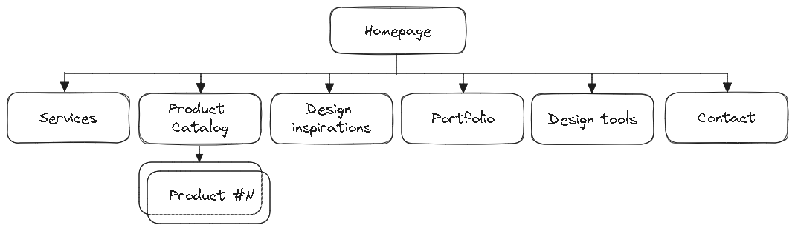
