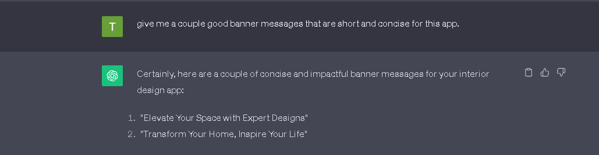
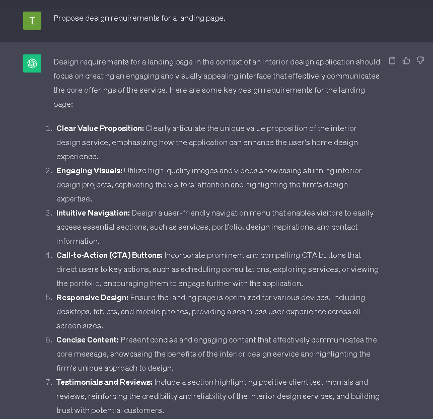
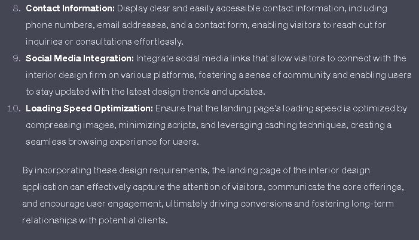
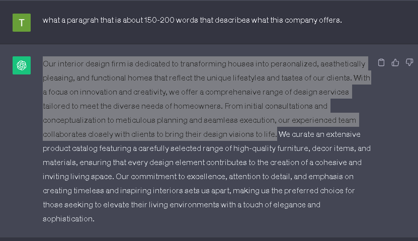

# [Class project 4: High/low fidelity design in figma]

### Final result - landing page of interior design app

### ChatGPT prompts - continued chat from user personas and IA (class-project-2)

#### 1. prompt

I have chosen the 2. option

#### 2. prompt

#### 3. prompt

The highlighted part of the text is what i decided to put into the design.
PS. the "what" in the prompt is a typo but ChatGPT correctly assumed it should be "write".
